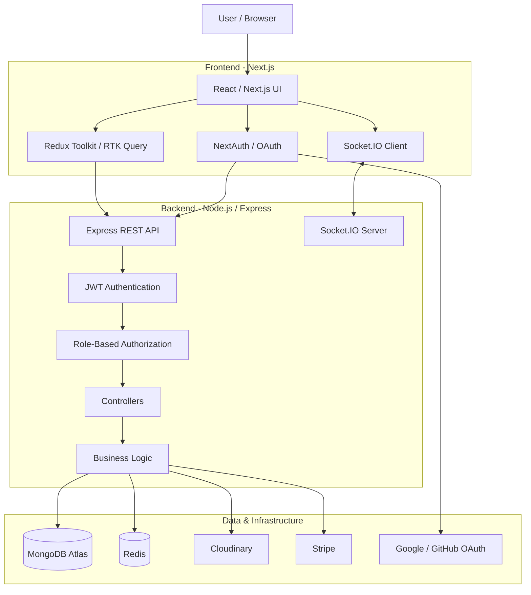

# eLearnSpace

<p align="center">
  <strong>A production-deployed full-stack Learning Management System built with Next.js, TypeScript, Node.js, Express, MongoDB, Redis, Socket.IO, Stripe, and OAuth.</strong>
</p>


<a href="https://youtu.be/my5ojpkMhoQ">
  
</a>


> A end to end system engineered to demonstrate real-world application architecture, authentication, authorization, payments, caching, real-time communication, media management, analytics, and cloud deployment.

<br>

**eLearnSpace** was designed beyond a basic CRUD application. The goal was to build an application where multiple production concerns interact with each other: authentication must survive browser refreshes, sessions must remain available across serverless invocations, database connections must be handled safely in a serverless environment, payments must result in application state changes, and important events must be delivered to connected users in real time.

The system provides separate experiences for **learners, instructors/course managers, and administrators**, with course management, enrollment, payments, user management, analytics, authentication, profile management, and real-time notifications.

---

## 🌐 Live Application

| Resource              | Link                                                                  |
| --------------------- | --------------------------------------------------------------------- |
| **Frontend**          | [eLearnSpace](https://elearnspace.vercel.app/)                        |
| **Backend API**       | [eLearnSpace Server](https://elearnspace-server.vercel.app/)          |
| **GitHub Repository** | [batoolarifa/eLearnSpace](https://github.com/batoolarifa/eLearnSpace) |

---

# 🏗️ System Architecture

eLearnSpace uses a **decoupled frontend/backend architecture**.

The frontend is deployed independently from the backend. REST APIs handle application data and business operations, while Socket.IO provides a separate real-time communication channel.




<br>

eLearnSpace was built with an emphasis on solving problems that appear in real production applications.

Instead of treating authentication, caching, real-time communication, and deployment as isolated features, the architecture was designed around how these systems interact under real request lifecycles.

Some of the key engineering concerns addressed in the project include:

* Maintaining authentication state across browser requests
* Protecting JWTs using HTTP-only cookies
* Handling access-token expiration through refresh tokens
* Maintaining server-side sessions using Redis
* Avoiding repeated database connection creation in serverless environments
* Supporting OAuth alongside traditional email/password authentication
* Synchronizing OAuth users with the application's own user database
* Providing real-time notifications without coupling them to REST responses
* Handling cross-origin requests between separately deployed frontend and backend applications
* Integrating third-party services such as Stripe and Cloudinary
* Designing the backend so it can operate correctly within a Vercel/serverless deployment model


# Core Features

## 🔐 1. Authentication & Authorization

The authentication system supports multiple authentication flows:

* Email/password registration
* Account activation
* Email/password login
* JWT access tokens
* JWT refresh tokens
* HTTP-only authentication cookies
* Google OAuth
* GitHub OAuth
* Logout
* Protected routes
* Role-based authorization
* Admin-only operations


## 📚 2. Course Management

The platform is centered around course management and learning core course functionality includes:

* Course creation
* Course editing
* Course publishing
* Course content management
* Course details
* Course access
* Course enrollment
* Course purchasing
* Course-related user data
* Course content retrieval
* Course administration

The application separates course data from user and order data, allowing the backend to determine which courses a user has access to.


## ✉️ 3. Email & Verification Integration

Email is integrated into the authentication lifecycle rather than being treated as an unrelated notification feature.

The application uses email-based workflows for authentication-related operations such as:

* Account activation
* Email verification
* OTP/verification flows
* Authentication-related email communication
* Verification state handling
* Secure environment-based email configuration

The important architectural boundary is that email credentials and delivery logic remain server-side rather than being exposed to the frontend.


##  💳 4. Payment Integration

Stripe is integrated into the course purchasing workflow. The frontend uses Stripe's payment components to securely handle payment details.

The application:

* Initializes Stripe on the frontend
* Uses Stripe Elements / Payment Element
* Confirms payments
* Verifies successful payment state
* Creates an application order after successful payment
* Associates the order with the course and user
* Updates the application state
* Provides access to the purchased course
* Emits a real-time order notification

Sensitive card information is handled by Stripe rather than being stored directly by eLearnSpace.


## 🔔 5. Real-Time Notifications

eLearnSpace uses **Socket.IO** for real-time communication.

Notifications are intentionally separated from normal REST API responses. For example, when an order is successfully created:

- The Socket.IO server listens for notification events and broadcasts the resulting event to connected clients.

This architecture allows events such as new orders or other application notifications to reach connected users without requiring constant polling.


## 👤 6. User Profile Management

Authenticated users can manage their profile information.

Features include:

* Profile information
* Avatar/profile picture
* Profile editing
* Password updates
* Authentication state
* User-specific course/order information

Cloudinary is used for image/media management instead of storing uploaded image files directly on the application server.


## 🧑‍💼 7. Admin Dashboard

The platform includes administrative functionality for managing the learning platform.

Administrative operations include:

* Viewing users
* Updating user roles
* Deleting users
* Managing courses
* Monitoring orders
* Viewing platform-level statistics
* Monitoring user activity
* Reviewing platform analytics

Administrative endpoints are protected using role-based authorization.


## 📊 8. Analytics & Dashboard

The application provides analytics-oriented dashboard data. The backend generates statistics that can be consumed by frontend dashboard components.

It include:

* Total users
* Published courses
* Total orders
* Monthly user activity
* Monthly enrollment/order trends
* Course-related statistics
* Dashboard KPIs
* Historical monthly analytics

The frontend visualizes this information through dashboard components and charts.


# ⚡ Frontend Architecture

The frontend uses:

* Redux Toolkit
* RTK Query
* React state
* NextAuth session state

RTK Query is responsible for communicating with the backend API and managing server-state concerns such as:

* API requests
* Mutations
* Query caching
* Refetching
* Loading states
* Error states

Authentication state is synchronized into Redux after successful authentication.


# ⚡ Backend Architecture

The backend follows a layered Express architecture. Major backend responsibilities are separated into:

* Routes
* Controllers
* Models
* Middleware
* Utilities
* Redis configuration
* Database configuration
* Socket.IO configuration
* Authentication utilities
* Error handling


# 🛡️ Security Architecture

Security was considered at multiple layers.

## Authentication Security

* JWT-based authentication
* Short-lived access tokens
* Refresh tokens
* HTTP-only cookies
* Secure cookies in production
* Redis-backed session validation
* Protected API routes

## Authorization Security

* Authentication middleware
* Role-based authorization
* Admin-only endpoints
* User-specific resource access

## API Security

* CORS configuration
* JSON request limits
* URL-encoded request limits
* Centralized error middleware
* Input validation
* Protected routes
* Environment variables for secrets


# 🧩 Technology Stack

## Frontend

| Technology       | Purpose                     |
| ---------------- | --------------------------- |
| Next.js          | Frontend framework          |
| React            | UI development              |
| TypeScript       | Static typing               |
| Redux Toolkit    | Application state           |
| RTK Query        | API/server-state management |
| Tailwind CSS     | Styling                     |
| Formik           | Form management             |
| Yup              | Validation                  |
| NextAuth         | OAuth/session integration   |
| Socket.IO Client | Real-time communication     |
| Stripe.js        | Payment UI                  |
| React Hot Toast  | User feedback               |
| React Icons      | UI icons                    |

## Backend

| Technology    | Purpose                    |
| ------------- | -------------------------- |
| Node.js       | Runtime                    |
| Express.js    | REST API                   |
| TypeScript    | Static typing              |
| Mongoose      | MongoDB ODM                |
| MongoDB Atlas | Persistent database        |
| Redis         | Session/cache layer        |
| JWT           | Application authentication |
| Socket.IO     | Real-time communication    |
| Cloudinary    | Media management           |
| Stripe        | Payment processing         |
| CORS          | Cross-origin API access    |
| Cookie Parser | Cookie handling            |

## Infrastructure & External Services

| Service       | Purpose                                |
| ------------- | -------------------------------------- |
| Vercel        | Frontend deployment                    |
| Vercel        | Backend/serverless deployment          |
| MongoDB Atlas | Database hosting                       |
| Redis         | Session/cache infrastructure           |
| Cloudinary    | Media infrastructure                   |
| Stripe        | Payment processing                     |
| Google OAuth  | Social authentication                  |
| GitHub OAuth  | Social authentication                  |
| Email Service | Verification and authentication emails |


# 📁 Project Structure

The repository maintains a clear boundary between the frontend application and backend API.

```text
eLearnSpace/
│
├── client/
│   │
│   ├── app/
│   ├── components/
│   ├── pages/
│   ├── public/
│   ├── redux/
│   │   └── features/
│   │       ├── api/
│   │       ├── auth/
│   │       ├── courses/
│   │       ├── orders/
│   │       └── ...
│   │
│   ├── utils/
│   ├── styles/
│   ├── package.json
│   └── ...
│
├── server/
│   │
│   ├── controllers/
│   ├── models/
│   ├── routes/
│   ├── middleware/
│   ├── utils/
│   ├── socketServer.ts
│   ├── server.ts
│   ├── app.ts
│   ├── vercel.json
│   └── ...
│
└── README.md
```


# ☁️ Deployment Architecture

The deployed system consists of several independent services.

```text
                       eLearnSpace
                           │
             ┌─────────────┴─────────────┐
             │                           │
             ▼                           ▼
     Vercel Frontend              Vercel Backend
     Next.js Application          Express API
             │                           │
             │                    ┌──────┼──────────┐
             │                    │      │          │
             │                    ▼      ▼          ▼
             │                 MongoDB Redis    Cloudinary
             │
             ▼
        OAuth Providers
             │
             ▼
      Google / GitHub

                    Backend
                       │
                       ▼
                     Stripe
```

### Production Services

* Frontend: Vercel
* Backend: Vercel
* Database: MongoDB Atlas
* Session/cache layer: Redis
* Media: Cloudinary
* Payments: Stripe
* OAuth: Google and GitHub
* Real-time communication: Socket.IO


# 📈 What This Project Demonstrates

eLearnSpace demonstrates practical experience with:

* Full-stack application development
* Next.js
* React
* TypeScript
* Node.js
* Express
* REST API design
* MongoDB
* Mongoose
* Redis
* JWT authentication
* Refresh-token architecture
* HTTP-only cookies
* OAuth
* Google authentication
* GitHub authentication
* Role-based authorization
* Redux Toolkit
* RTK Query
* Socket.IO
* Real-time notifications
* Stripe payments
* Cloudinary
* CORS
* Serverless deployment
* Vercel
* Environment-based configuration
* API error handling
* Database connection management
* Production debugging


# 🧩 Engineering Mindset

The main engineering goal behind eLearnSpace was not simply to make individual features work.

The project was built around the question:

> **How do these components continue to work when they are deployed, distributed, authenticated, and dependent on external infrastructure?**

That led to several architectural decisions:

```text
Authentication
      │
      ├── JWT
      ├── Cookies
      └── Redis

Payments
      │
      ├── Stripe
      ├── Orders
      └── Notifications

Deployment
      │
      ├── Vercel
      ├── Serverless lifecycle

Real-time communication
      │
      ├── Socket.IO Server
      └── Socket.IO Client

OAuth
      │
      ├── Google
      ├── GitHub

```

The result is an application where individual features are connected through deliberate system boundaries rather than implemented as isolated components.


# 🧪 Running Locally

Follow the steps below to run **eLearnSpace** locally.

## 1. Clone the repository

```bash
git clone https://github.com/batoolarifa/eLearnSpace.git
cd eLearnSpace
```

## 2. Install dependencies

The project contains separate frontend and backend applications.

### Backend

```bash
cd server
npm install
```

### Frontend

Open another terminal:

```bash
cd client
npm install
```


## 3. Configure environment variables

Both applications require their own environment configuration.

Create the appropriate `.env` files inside the `server` and `frontend` directories.

### Backend environment variables

The backend requires configuration for:

```env
PORT=
NODE_ENV=

MONGODB_URI=

REDIS_URL=

ACCESS_TOKEN=
REFRESH_TOKEN=

ACCESS_TOKEN_EXPIRE=
REFRESH_TOKEN_EXPIRE=

CLOUDINARY_CLOUD_NAME=
CLOUDINARY_API_KEY=
CLOUDINARY_API_SECRET=

STRIPE_SECRET_KEY=

GOOGLE_CLIENT_ID=
GOOGLE_CLIENT_SECRET=

GITHUB_CLIENT_ID=
GITHUB_CLIENT_SECRET=

CLIENT_URL=
```

These variables configure the database, Redis session layer, JWT authentication, Cloudinary media management, Stripe payments, OAuth providers, and frontend origin.

### Frontend environment variables

The frontend requires configuration for the deployed/local API and authentication services, including:

```env
NEXT_PUBLIC_SERVER_URI=
NEXT_PUBLIC_SOCKET_SERVER_URI=

NEXTAUTH_URL=
NEXTAUTH_SECRET=

GOOGLE_CLIENT_ID=
GOOGLE_CLIENT_SECRET=

GITHUB_CLIENT_ID=
GITHUB_CLIENT_SECRET=

NEXT_PUBLIC_STRIPE_PUBLISHABLE_KEY=
```


## 4. Run the backend

From the `server` directory:

```bash
npm run dev
```

The API is exposed under:

```text
http://localhost:8000/api/v1
```


## 5. Run the frontend

From the `frontend` directory:

```bash
npm run dev
```


External services such as MongoDB Atlas, Redis, Cloudinary, Stripe, Google OAuth, and GitHub OAuth must be configured with valid credentials.

For OAuth authentication, the provider callback URLs must match the local authentication configuration.


 ## 👩‍💻 Author

**Syeda Arifa Batool** focused on building practical, production-oriented applications and continuously growing as a software engineer.


## 🔗 **Connect with Me**

- **LinkedIn:** [Syeda Arifa Batool](https://www.linkedin.com/in/arifa-batool/)  
- **Kaggle:** [Syeda Arifa Batool](https://www.kaggle.com/thearifabatool)  
- **Email:** [thearifabatool@gmail.com](mailto:thearifabatool@gmail.com)


 

### ⭐ If you found this project interesting

Feel free to explore the repository, review the architecture, and try the live application.

